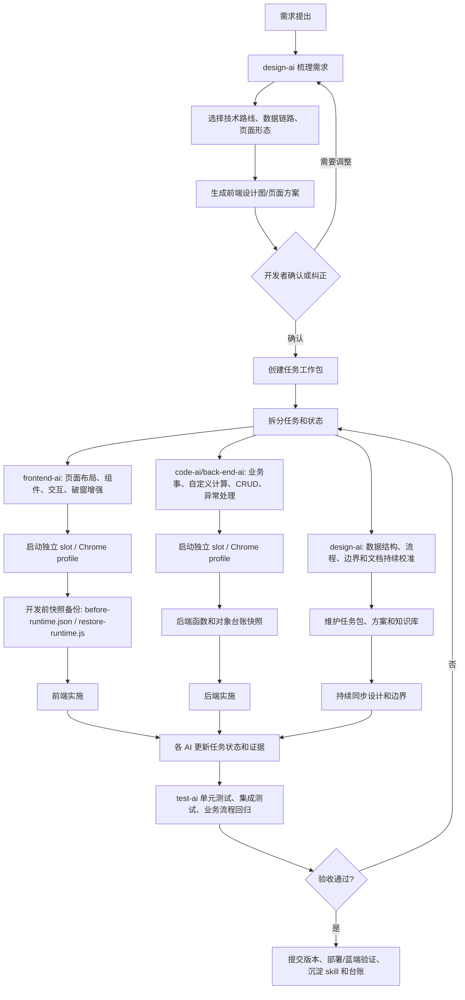

# WOS4.5 开发思路

本文用于说明 WOS4.5 项目的开发方式、多用户并行机制、前端扩展能力、数据和页面回灌路线、当前理解边界，以及平台底层能力的兼容要求。

## 简单概述

当前开发方式不是修改 WOS4 平台源码，而是在 WOS4 的建模、页面精灵图、组件配置、事件脚本、自定义计算、组态和部署链路内开发；平台原生能力够用的地方全部用原生能力，原生能力不够的地方，在页面运行态做可回收的“破窗增强”。所有模型、页面、后端、部署和运行对象都通过本地知识库、台账、备份和验证证据管理，确保多人可以并行开发，也能追溯和回灌。

## 整体思路图

本项目本质上不是单纯“写页面”或“写后端”，而是一个 AI 协助治理工程：人负责判断、取舍、验收和调度，AI 负责把明确后的方案落到 WOS4 平台里，并把过程沉淀成可复用知识。



这个流程的目标是：开发者尽量省去具体代码和重复点击过程，把精力放到需求判断、方案校正、风险确认和验收上。

## 一、开发方式

### 1. 总体开发链路

当前有效链路按层次拆开：

```text
建模系统客户端
-> 前端页面精灵图 / 后端业务事 / 自定义计算
-> 组态系统客户端配置页面引用和运行实例
-> 运维部署客户端更新、部署、启动
-> 时空对象管理平台确认已上线对象
-> 蓝色客户端或预览页做最终验收
```

关键点：

- 建模系统里做前端页面、后端模型和函数。
- 组态系统里把页面、时空、客户端和运行实例组织起来。
- 运维部署里才是真正部署、更新和启动。
- 时空对象管理平台只看已上线对象和调试，不在里面绕过流程新建后端或页面。
- 蓝色客户端是最终用户入口，建模预览正确不代表蓝色客户端已经更新。

### 2. 多用户并行开发

并行开发把四件事拆开：

- WOS4 登录账号池：使用账号别名和会话槽位管理，不在对外说明里暴露具体账号姓名。
- 浏览器会话：不同 Chrome profile、不同 CDP 端口、不同 browser-harness 会话。
- AI 身份：`design-ai`、`frontend-ai`、`code-ai`、`test-ai`、`review-ai`。
- WOS4 对象锁：页面、后端函数、客户端、部署对象分别加锁。

这样做的结果是：

- 多个账号可以同时看不同对象。
- 多个浏览器 profile 不共享登录态，互不污染。
- 一个账号下可以切换不同 AI 身份，但不重复占账号席位。
- 修改同一个页面或函数前必须拿对象锁，避免两个人同时保存覆盖。

### 3. 分工方式

任务不是由单一角色从头做到尾，而是按职责拆分：

- `design-ai`：确认需求、数据结构、系统能力和阶段方案。
- `frontend-ai`：做页面布局、组件、变量、交互和运行态增强。
- `code-ai`：做后端函数、本地脚本、skill、知识库和文档。
- `test-ai`：做验证、截图、回归和验收记录。
- `review-ai`：检查 Git diff、安全、配置隔离和文档准确性。

复杂任务会建任务工作包，记录需求、设计、前端、后端、测试、证据和执行日志。

### 4. AI 协助治理工程的结构

项目里有几类核心资产：

- AI 路引：`AGENTS.md`，规定 AI 身份、恢复规则、WOS4 操作边界和验收规则。
- AI 身份：`.ai/agents/`，定义 design-ai、frontend-ai、code-ai、test-ai、review-ai 的职责。
- 项目 skill：`.ai/skills/`，沉淀登录、布局、组件、变量、后端、部署、蓝端、对象台账等可复用流程。
- 项目文档：`.ai/docs/`，沉淀目录规则、备份策略、版本树、工具使用和治理原则。
- 说明书索引知识库：`wos4-artifacts/docs/wos4-help-kb/`，把 WOS4 帮助手册整理成可检索、可路由的本地知识库，包含章节索引、任务路由、符号索引、元语言函数、JS 函数、数据结构、系统枚举和错误码。
- 任务工作包：`wos4-artifacts/tasks/`，一个复杂任务一个目录，包含需求、设计、前端、后端、测试、执行日志和证据清单。
- 证据区：`wos4-artifacts/screenshots/`、`snapshots/`、`reports/`、`backups/`，保存截图、JSON、报告和可回灌材料。
- 三类台账：模型台账、运行对象台账、方法台账，分别记录建模侧、运行侧和函数/调用关系。
- Git 同步：本地规则、文档、skill、脚本、证据和台账通过 Git 管理，方便多人协作和跨天恢复。

这套结构解决的是“多人、多 AI、多页面、多后端对象长期协作时怎么不乱”的问题。

### 5. slot 并行和效率边界

WOS4 的难点不只是写代码，而是大量页面操作：登录、进入客户端、打开页面、等待弹窗、点击菜单、保存、提交、预览、部署、回到对象管理平台验证。AI 通过 browser-harness 或 Chrome CDP 模拟人的点击、输入、读取 DOM 和执行脚本。

效率边界大致是：

- 单 slot 时，AI 在页面设计和后端代码开发上通常快于人类，因为它可以持续读配置、生成脚本、执行重复操作。
- 单 slot 点击跳转页面时慢于熟练人类，因为平台页面加载、弹窗判断和等待稳定都需要保守处理。
- 跨夜开发时，AI 可以补足人类不能长时间连续工作的时间，整体产出会超过单人持续操作。
- 两个 slot 并行时，效率明显超过单人，因为前端和后端可以同时推进，互不等待。
- 一个开发者大约可以管理 3 个 slot 并行：一个 AI 执行时，开发者可以处理另一个 AI 的反馈，再准备第三个 AI 的判断输入。
- 4 个 slot 并行开始考验调度能力和脑力，容易出现反馈积压、判断疲劳和错误任务分配。

传统开发里，最费脑的是“怎么实现”，写代码阶段更多考验熟练度。AI 协助治理后，AI 承担了大量实现过程，人会长期处在更费脑的阶段：判断需求、选择路线、纠偏、验收、决定是否回滚、决定哪个 AI 继续做。

## 二、技术路线和技术栈

### 1. 平台技术栈

主要依赖 WOS4.5 自身能力：

- 建模系统客户端：页面精灵图、业务事、业务物、自定义计算。
- 页面组件体系：`RContainer / RRow / RCol`、输入框、按钮、表格、ECharts、树、菜单、弹窗等。
- 页面脚本：创建时、存在时、关闭时、变量改变时、按钮点击、表格点击等脚本入口。
- WOS JS 运行态：`SetRunInfo`、`Call`、`StringMap`、`Variant`。
- 后端元语言：业务事查询、新增、更新、删除，自定义计算函数，统一异常处理。
- 组态系统客户端：运行实例、客户端画面、页面引用、时空配置。
- 运维部署客户端：更新、部署、启动。
- 时空对象管理平台：查看已上线对象、记录、GUID、运行状态和调试。

### 2. 本地工程技术栈

本地工程不替代 WOS4，只负责规则、自动化和证据：

- Git：管理 AI 规则、skill、文档、脚本、证据和导出快照。
- Markdown：写方案、报告、说明和台账。
- PowerShell：账号锁、对象锁、preflight、备份和本地检查。
- browser-harness / Chrome CDP：接管已登录浏览器，读取页面、点击、截图、执行运行态脚本。
- Playwright：必要时作为浏览器自动化兜底。
- JSON 快照：保存页面 runtime、组件树、函数返回、验证结果。
- 本地 WOS4 帮助知识库：查询元语言函数、JS 函数、错误码、数据结构和平台概念。

### 3. 前端技术路线

前端路线是“原生优先，增强兜底”：

1. 先搭 WOS4 原生布局：`RContainer / RRow / RCol`。
2. 再放原生组件：输入框、按钮、表格、图表、菜单、页面容器。
3. 能用原生 `detailConfig / styleConfig / linkList / 页面变量 / 变量改变时脚本` 解决的，就用原生。
4. 原生组件无法实现的交互，在页面运行态做“破窗增强”。
5. 增强只接管局部 DOM 或局部行为，不替换整个平台页面。
6. 每次保存、提交、预览、蓝色客户端验证都留证据。

### 4. 后端技术路线

后端路线是“模型定义 + 自定义计算 + 运行对象验证”：

1. 在建模系统里定义业务事/业务物字段。
2. 按历史、计划、实时选择正确对象形态。
3. 在自定义计算里写函数，例如查询、新增、更新、删除、评分提交、统一异常处理。
4. 函数统一返回 JSON 字符串，包含 `ok/code/message/data/traceId`。
5. 前端 `Call` 后端前先 `SetRunInfo` 到目标时空和运行对象。
6. 参数必须和后端签名一致，例如后端是 `stringMap<var> strmapPara`，前端不能传空数组。
7. 真正验收不只看编译成功，要看调试变量、返回值、时空对象管理平台记录或蓝端调用结果。

## 三、前端破窗增强怎么做

### 1. 破窗增强的定义

破窗增强不是改平台源码，而是：

- 平台原生组件继续负责主体能力。
- 只在运行态接管一个局部能力。
- 部分场景会直接操作运行态 DOM，等于绕过 Vue 组件当前暴露出来的交互封装，但不修改 Vue 源码，也不替换平台组件的数据来源。
- 接管逻辑可删除、可重跑、可回滚。
- 平台后续如果提供原生能力，增强逻辑可以下线。

更具体地说，破窗通常由三层组成：

- 页面级函数挂载：在页面脚本里把增强函数挂到带项目前缀的全局对象上，例如 `window.__palDecorateActionButtons`、`window.__palHandleTableAction`，用于后续按钮事件、查询回调或调试时调用。
- 局部 DOM 接管：等平台组件渲染完成后，定位某个局部 DOM，例如表格操作列单元格，把原本文字替换成按钮、菜单或弹窗入口。
- 事件和重渲染补偿：给新插入的按钮绑定点击事件；平台或 Vue 重新渲染后，再次执行装饰函数，把被覆盖的增强补回来。

所以“挂载函数”是破窗的一部分，但不是全部。完整破窗是：挂函数保存增强能力，接管局部 DOM 实现平台没有的交互，再处理事件绑定和重渲染后的恢复。

### 2. 例子：表格操作列

在 `PalimpsestContent_82` 页面里，原生表格可以显示数据和列，但操作列最初只能显示一串文字：

```text
查看 评分 编辑 更多
```

问题是：

- 操作文字容易重叠。
- 每个动作不能天然绑定独立弹窗。
- `更多` 菜单不能出现在当前按钮旁边。
- 编辑后要调用真实后端更新，这个链路原生表格列不好直接表达。

处理方式：

1. 数据查询、列配置、基础表格仍用 WOS4 原生表格。
2. 查询完成后，保存当前行数据和 `recordID`。
3. 等表格 DOM 渲染完成后，找到操作列单元格。
4. 把操作列里的纯文本替换为按钮组：`查看`、`评分`、`编辑`、`更多`。
5. 按钮点击时读取当前行 `recordID`。
6. `查看` 打开只读弹窗。
7. `编辑` 打开编辑弹窗，提交后调用真实后端更新函数。
8. `更多` 在按钮旁边打开二级菜单。
9. 表格重新渲染后，再执行一次装饰函数。

示意代码：

```js
function decorateAssessmentTableActions() {
  var rows = document.querySelectorAll(".pal-assessment-table tbody tr");
  rows.forEach(function(rowEl, rowIndex) {
    var rowData = window.__palAssessmentRows[rowIndex];
    var actionCell = rowEl.querySelector("td:last-child");
    if (!rowData || !actionCell || actionCell.dataset.palDecorated === "1") return;

    actionCell.dataset.palDecorated = "1";
    actionCell.innerHTML = "";

    ["查看", "评分", "编辑", "更多"].forEach(function(label) {
      var btn = document.createElement("button");
      btn.textContent = label;
      btn.className = "pal-action-btn";
      btn.onclick = function(event) {
        event.stopPropagation();
        window.__palHandleTableAction(label, rowData, btn);
      };
      actionCell.appendChild(btn);
    });
  });
}
```

这个例子说明：

- 表格还是平台表格。
- 数据还是平台数据和后端数据。
- 增强范围只限操作列这一小块。
- 这类增强确实直接接管了操作列 DOM，绕过了 Vue 组件原本没有提供的“操作列按钮组/行内菜单”封装。
- Vue 或平台表格一旦重渲染，手工插入的按钮可能被覆盖，所以增强函数必须可重复执行、幂等装饰，并且不能把真实数据只存在 DOM 里。
- 增强依赖表格 DOM、事件、脚本生命周期和 `document.createElement` 能力。

## 四、数据回灌和页面回灌

### 1. 回灌分两类

“回灌”分两种：

- 页面回灌：把页面布局、组件、变量、脚本恢复到某个修改前状态。
- 数据回灌：把业务数据或测试数据重新写回 WOS4 业务事/业务物，或重新查询后刷新前端表格。

### 2. 页面回灌技术路线

页面回灌依赖两个核心文件：

- `before-runtime.json`：修改前页面运行态快照。
- `restore-runtime.js`：把快照恢复到编辑器 runtime 的回灌脚本。

真实例子：

任务工作包：

```text
D:\DEV_D\WOS4.5\wos4-artifacts\tasks\20260623-新测试页左右菜单CRUD弹窗设计\
```

备份目录：

```text
D:\DEV_D\WOS4.5\wos4-artifacts\backups\Palimpsest内容页输入框和间距修复-20260623T190500\
```

关键文件：

```text
D:\DEV_D\WOS4.5\wos4-artifacts\backups\Palimpsest内容页输入框和间距修复-20260623T190500\backup-manifest.json
D:\DEV_D\WOS4.5\wos4-artifacts\backups\Palimpsest内容页输入框和间距修复-20260623T190500\before-editor.png
D:\DEV_D\WOS4.5\wos4-artifacts\backups\Palimpsest内容页输入框和间距修复-20260623T190500\before-runtime.json
D:\DEV_D\WOS4.5\wos4-artifacts\backups\Palimpsest内容页输入框和间距修复-20260623T190500\restore-runtime.js
```

回灌步骤：

1. 打开建模系统中对应页面精灵图，例如 `PalimpsestContent_82`。
2. 确认编辑器 runtime 已加载，组件树非空。
3. 执行 `restore-runtime.js`。
4. 脚本读取同目录或内置的 `before-runtime.json` 结构。
5. 恢复布局、组件配置、变量和脚本。
6. 先人工检查画布和组件树。
7. 确认无误后再保存、提交、预览。

结论：截图不能回灌，截图只是证据。真正能回灌的是 `before-runtime.json + restore-runtime.js`。

### 3. 数据回灌技术路线

数据回灌不是直接改前端 DOM，而是走后端或平台数据对象：

```text
前端按钮或调试脚本
-> SetRunInfo 指向目标时空和后端运行对象
-> Call 自定义计算函数
-> 后端 Query/Create/Update/Delete 业务事
-> 返回统一 JSON
-> 前端刷新表格或状态
```

对于 `pal_assessment_record` 这类历史业务事，数据回灌可以是：

- 调用 `CreateAssessmentRecord` 插入测试记录。
- 调用 `UpdateAssessmentRecord` 修复某条记录。
- 调用 `DeleteAssessmentRecord` 标记删除或删除记录。
- 调用 `QueryAssessmentRecords` 查询真实记录，刷新前端表格。

技术边界：

- 不能只在前端表格里写假数据当成回灌。
- 后端必须返回 `ret=0` 或统一 JSON 的 `ok=true`。
- 最好在时空对象管理平台里看到真实记录变化。
- 历史业务事和计划业务事的查询、写入方式可能不同，不能混用。
- 19 位 WOS ID 不能用 JS Number 传递，避免精度丢失。

## 五、知识库和台账

知识库分成三层。

### 1. 项目路引

入口：

```text
D:\DEV_D\WOS4.5\AGENTS.md
```

它规定 AI 身份、操作前要读哪些 skill、WOS4 操作规则、备份规则、弹窗优先级和验收规则。

### 2. 项目知识库

项目规则和说明：

```text
D:\DEV_D\WOS4.5\.ai\docs\
```

项目操作 skill：

```text
D:\DEV_D\WOS4.5\.ai\skills\
```

WOS4 帮助手册知识库：

```text
D:\DEV_D\WOS4.5\wos4-artifacts\docs\wos4-help-kb\
```

这里面有元语言函数、JS 函数、错误码、数据结构、系统枚举和操作手册。

### 3. 对象台账

建模侧对象：

```text
D:\DEV_D\WOS4.5\wos4-artifacts\docs\wos4-model-registry.md
```

运行侧对象：

```text
D:\DEV_D\WOS4.5\wos4-artifacts\docs\wos4-runtime-object-registry.md
```

方法台账：

```text
D:\DEV_D\WOS4.5\wos4-artifacts\docs\wos4-method-registry.md
```

这些台账记录模型 ID、GUID、业务事 ID、copy GUID、clientGuid、字段、函数签名和验证证据。

## 六、可回收 skill 和前期沉淀成本

当前效率不是一开始就具备的。WOS4.5 页面开发、后端调试、组态、部署和蓝色客户端发布都不是标准 Web 项目的开发方式，早期花费了大量时间用于摸索入口、验证流程、定位平台边界、记录失败原因，并把可复用经验沉淀成 skill。

前期主要成本包括：

- 登录、会话失效、弹窗优先级和浏览器接管方式验证。
- 页面精灵图编辑器的布局树、组件树、变量表和脚本生命周期摸索。
- 表格、ECharts、菜单、页面容器、报表组件等原生组件能力边界测试。
- 保存、提交、预览、组态引用、蓝色客户端发布之间的版本差异排查。
- 后端业务事字段、历史/计划/实时形态、自定义计算函数和调试配置摸索。
- 运维部署、时空对象管理平台、运行对象 GUID、copy GUID、clientGuid 的链路核实。
- 多账号、多 slot、对象锁、Git 同步和跨天恢复规则沉淀。

这些时间投入已经回收为项目 skill，后续同类任务可以直接复用，不需要重复踩坑。

已沉淀的可回收 skill 包括：

- `wos4-login`：登录、会话恢复、账号配置校验。
- `wos4-browser-harness`：使用 browser-harness 接管 Chrome、读取 DOM、截图、执行脚本。
- `wos4-layout-devtools-skill`：页面布局只用 `RContainer / RRow / RCol` 先稳定结构，再放业务组件。
- `wos4-component-persistence`：组件配置、保存、提交、预览后的持久化检查。
- `wos4-component-catalog`：组件目录和能力边界查询。
- `wos4-style-config`：组件样式配置和视觉增强。
- `wos4-page-runtime-backup`：页面 runtime 快照、`before-runtime.json`、`restore-runtime.js` 回灌能力。
- `wos4-page-variable-edit`：页面变量扫描、变量默认值和变量改变时脚本修改。
- `wos4-button-variable-flow`：按钮触发变量变化，再由变量改变时脚本执行查询或刷新。
- `wos4-interaction-flow-skill`：页面交互、按钮、弹窗、表格操作的可验证链路。
- `wos4-business-event-member-edit`：业务事字段、类型、形态和成员编辑边界。
- `wos4-meta-language-fu-create`：自定义计算函数创建和结构规范。
- `wos4-meta-language-debugger`：后端断点、变量、堆栈、调试通过标准。
- `wos4-meta-language-fu-release-package`：后端模型提交、运行包和发布边界。
- `wos4-runtime-package-update`：运行包更新和运维部署链路。
- `wos4-blue-client-publish-flow`：蓝色客户端发布、组态引用、版本刷新和验收。
- `wos4-object-registry`：建模侧、运行侧、方法侧台账维护。

这些 skill 的意义是把早期探索成本变成可复用资产。后续开发时，AI 不再从“猜页面怎么点、猜组件怎么存、猜后端怎么调”开始，而是先读取对应 skill，按已验证路径执行；人主要负责需求判断、路线取舍和结果验收。

## 七、当前理解边界

### 1. 已经明确的

- 建模、组态、运维、对象管理是不同层。
- 时空对象管理平台看到的，才是已上线运行对象。
- 建模预览正确，不代表组态或蓝色客户端已更新。
- 组态里的引用页面可能不会自动更新，必要时要删除旧引用并重新添加。
- 前端调用后端前，需要设置目标时空和后端运行对象。
- 后端函数签名和前端参数必须一致。
- 编译成功不等于调试通过，必须有返回值或真实记录证据。

### 2. 仍需谨慎的

- 表格、树、弹窗等组件的内部 DOM 不是平台正式公开 API。
- 某些事件在编辑器、预览、蓝色客户端表现可能不同。
- 后端元语言 Query/Create/Update/Delete 的复杂条件仍需要更多手册和实测。
- 平台版本、缓存和运行包更新可能造成“模型已保存但运行态仍旧”。
- 中文编码在部分脚本写入链路里会变成 `???`，要使用 UTF-8、Unicode escape 或 base64 SVG。

## 八、平台升级兼容点

如果平台软件升级，以下能力最好保持兼容，或者给正式替代 API。

### 1. 页面组件树和运行态对象

当前增强和自动化依赖：

- `PageView`。
- 页面变量结构。
- `comMap.$Children` 或等价组件树。
- 组件名称和组件对象。
- `detailConfig / styleConfig / linkList`。

如果这些结构大改，页面自动化、回灌和破窗增强会受影响。

### 2. 页面容器加载能力

框架页需要右侧容器加载子页面，类似：

```js
RCol12.setPage("PalimpsestContent_82")
```

如果平台改变 `setPage`、页面名解析、页面引用规则，需要提供新的公开 API。

### 3. 表格 DOM 和事件

表格操作列增强依赖：

- 能定位表格行和单元格。
- 能绑定按钮点击事件。
- 能拿到当前行数据或 `recordID`。
- 表格重渲染后可以再次装饰。

如果表格改成 Shadow DOM、强虚拟滚动、不可访问单元格 DOM，需要提供原生操作列按钮能力。

### 4. 脚本生命周期

需要保持：

- 页面创建时。
- 页面存在时。
- 页面关闭时。
- 变量改变时。
- 按钮点击。
- 表格单元格点击。

如果生命周期触发顺序变化，需要明确新的规则。

### 5. 后端调用 API

需要保持：

- `SetRunInfo`。
- `Call`。
- `StringMap`。
- `Variant`。
- 返回值结构。

尤其是 `stringMap<var>` 参数包装规则，必须有稳定示例。
